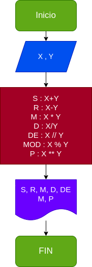

# Operaciones_Aritmeticas
un programa para calcular sumas,restas,multiplicaciones,divisiones,divisiones enteras ,modulo,potencia
## calcular mediante 2 numeros enteros varias operaciones aritmeticas

# analisis

-variables de entrada

X y Y : 2 numeros naturales ingresados para sacarles sus operaciones aritmeticas respectivas

-variables de salida

S: suma
R: Resta
M: Multiplicacion
D: Division
DE: Division entera
MOD: Modulo
P: Potencia

# Diseño

# CONSTRUCCION

ejecicio n.3 Implemetar un programa para operaciones aritmeticas

S : X+Y
R : X-Y
M : X * Y
D : X/Y
DE : X // Y
MOD : X % Y
P : X ** Y

## ESTE ARCHIVO ESTA ESCRITO NE LENGUAJE MARKDOWN